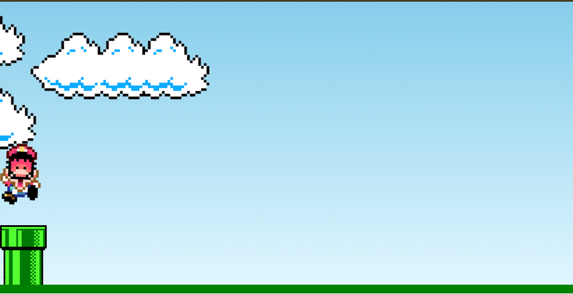

# Jogo do Mario Básico 

 

# 📃 Descrição:

Este repositório contém um jogo simples do Mario, construído com: 
- HTML
 - CSS
- JavaScript. 

 O objetivo é pular sobre canos e evitar colisões.

#

#  Funcionalidades:

- Movimento do Mario: O Mario se move automaticamente para a direita.
- Pular: Pressione qualquer tecla para fazer o Mario pular.
- Detecção de colisão: O jogo termina se o Mario colidir com um cano.
- Tela de Game Over: Uma imagem de Game Over é exibida ao final da partida.

# Estrutura do projeto:

- `index.html:` Página principal do jogo.
- `css/style.css:` Arquivo CSS contendo os estilos do jogo.
- `js/script.js:` Arquivo JavaScript contendo a lógica do jogo.
- `img/:` Pasta contendo as imagens utilizadas (mario.gif, clouds.png, pipe.png, game-over.png).

# 🎮 Como jogar:

1. Abra o arquivo `index.html` em um navegador web.
2. Pressione qualquer tecla para fazer o Mario pular.
3. Evite colidir com os canos.
- O jogo termina se o Mario colidir com um cano, exibindo a tela de Game Over.

# 📸 Screenshots:
 

  
  

  

# Deploy:

- Projeto online: [https://jogomario-github-io.vercel.app/]

# 💭 Observação:
Este é um jogo básico, sem pontuação ou níveis adicionais.
# Esperamos que este projeto seja útil!
